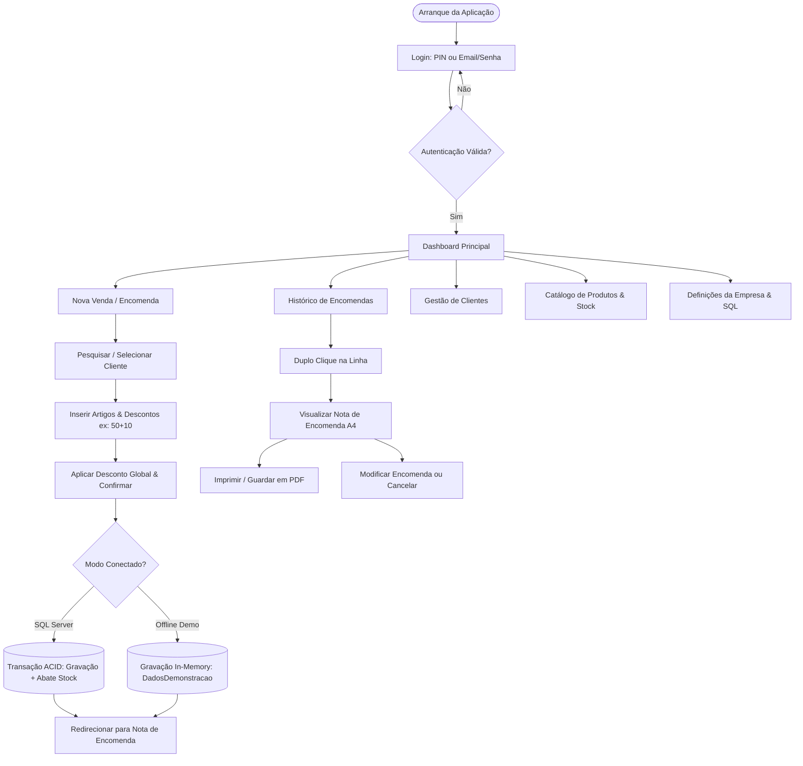
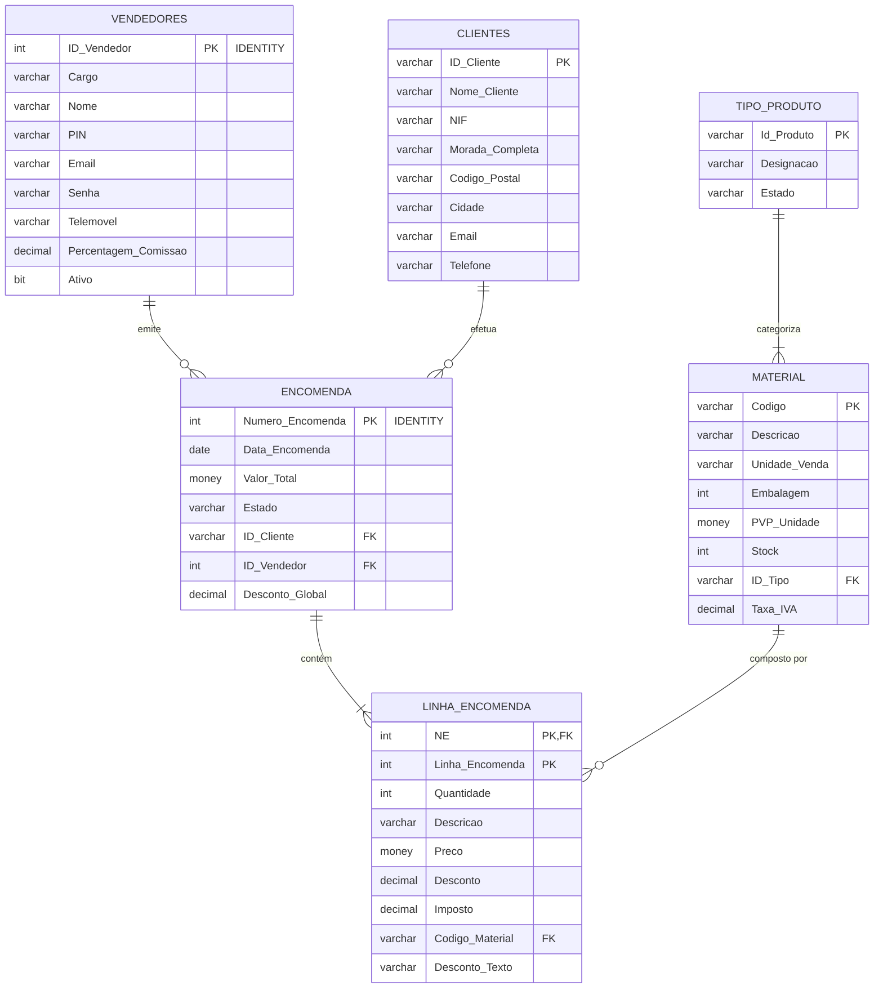

# 💼 Commercial Sales Manager (SFA)

[](https://dotnet.microsoft.com/)
[](https://docs.microsoft.com/dotnet/csharp/)
[](https://learn.microsoft.com/aspnet/core/blazor/hybrid/)
[](https://tailwindcss.com/)
[](https://www.microsoft.com/sql-server/)
[]()
[](https://visualstudio.microsoft.com/)
[](LICENSE)

> Sistema Desktop Corporativo de **Sales Force Automation (SFA)** e Gestão de Encomendas B2B desenvolvido para otimizar o fluxo operacional de uma Direção Comercial no setor de distribuição técnica e material elétrico.

---

## 📖 Visão Geral & Contexto

Nas operações comerciais de distribuição B2B, grande parte dos registos de encomendas e acordos de preços ainda é realizada com recurso a blocos de papel químico (*notas de encomenda manuscritas*), cálculos manuais de descontos em cascata e posterior transcrição para o software de faturação central.

O **Commercial Sales Manager** digitaliza e automatiza integralmente este ciclo de trabalho:
* **Identificação Imediata de Clientes:** Pesquisa preditiva por NIF, Razão Social, Telefone ou Localidade.
* **Catálogo Técnico & Stock em Tempo Real:** Consulta de artigos com indicação de inventário disponível e reposição imediata.
* **Motor de Desconto B2B em Cascata:** Suporte a expressões comerciais compostas (ex: `50+10`, `40+5+2`), amplamente utilizadas pelos fabricantes de material elétrico.
* **Emissão e Impressão de Notas de Encomenda A4:** Layout corporativo padronizado pronto para impressão física ou arquivo em PDF.
* **Acompanhamento de Comissões e Vendas:** Painel executivo com métricas financeiras consolidadas por período e exportação para Excel (CSV).
* **Operação Híbrida Inteligente:** Conectividade nativa com Microsoft SQL Server e transição transparente para modo offline/demonstração quando fora de rede.

---

## 🏗️ Arquitetura do Sistema

A aplicação adota uma arquitetura moderna **Desktop Híbrida (.NET 8 + Blazor WebView)**:

```
┌─────────────────────────────────────────────────────────────┐
│               Windows Forms Shell Host                      │
│               (Form1.cs com BlazorWebView)                  │
├─────────────────────────────────────────────────────────────┤
│         Blazor WebView Components (HTML5 / Tailwind CSS)    │
│  ├── Dashboard.razor       ├── Clientes.razor               │
│  ├── NovaVenda.razor       ├── Produtos.razor               │
│  ├── Encomendas.razor      ├── Definicoes.razor             │
│  └── DetalhesEncomenda.razor                                │
├─────────────────────────────────────────────────────────────┤
│                    C# Business Logic Layer                  │
│  ├── Sessao.cs (Autenticação e Comissões)                   │
│  ├── ConfiguracaoEmpresa.cs (Perfil da Empresa em JSON)     │
│  └── DatabaseConfig.cs (Deteção e Conectividade SQL)        │
├──────────────────────────────┬──────────────────────────────┤
│    Modo Online (Produção)    │   Modo Offline (Demonstração)│
│    Microsoft.Data.SqlClient  │   DadosDemonstracao.cs       │
│    Microsoft SQL Server      │   Armazenamento em Memória   │
│    Base: Software_Vendas_Pai │   Catálogo Elétrico Mock     │
└──────────────────────────────┴──────────────────────────────┘
```

### Destaques da Arquitetura:
1. **Host Nativo Windows Forms:** Executável leve sem sobrecarga de servidores web locais, garantindo desempenho instantâneo de arranque.
2. **Componentes Blazor Reativos:** Interface fluida, sem recarregamentos bruscos de janela, desenhada com o ecossistema utilitário do Tailwind CSS.
3. **Isolamento de Estado:** Sessão do vendedor, parametrizações da empresa e dados transacionais desacoplados da camada visual.

---

## ✨ Funcionalidades Principais

### ⚡ Autenticação Comercial Ergonómica
* **Modo Dual de Acesso:**
  * **PIN de 4 dígitos:** Concebido para postos móveis e ecrãs táteis, permitindo autenticação rápida entre visitas a clientes.
  * **E-mail & Senha:** Método tradicional com suporte a múltiplos perfis (Vendedor, Diretor Comercial, Administrador).
* **Gestão de Sessão Centralizada (`Sessao.cs`):** Retém em memória os dados do utilizador ativo, cargo e percentagem de comissão contratual.

### 📦 Catálogo de Artigos & Controlo de Stock
* **Pesquisa Preditiva de Artigos:** Filtragem instantânea por código de referência ou descrição do material.
* **Ajuste Rápido de Inventário:** Modal integrado para dar entrada ou baixa de unidades sem sair do ecrã de vendas.
* **Criação de Artigos:** Suporte ao registo de novos produtos com categoria/família, PVP de tabela e IVA configurável.

### 🧮 Motor de Descontos Comerciais em Cascata
No setor elétrico e da distribuição técnica, as tabelas de descontos de fabricantes funcionam por escalões sucessivos:
$$\text{Preço Efetivo} = \text{PVP} \times (1 - d_1) \times (1 - d_2) \times \dots \times (1 - d_n)$$

* **Expressões Suportadas:** `50+10`, `40+5+2.5`, ou percentagens padrão simples (`35%`).
* **Desconto Global Extra:** Aplicação de desconto financeiro no fecho global da nota de encomenda.
* **Cálculo Automático de IVA:** Incidência da taxa legal em vigor (23%) com cálculo exato de subtotal, imposto e valor final.

### 🛡️ Persistência ACID e Abate Atómico de Stock
* Todas as encomendas geradas no modo SQL Server utilizam `SqlTransaction`.
* Ao confirmar a venda:
  1. Cria o cabeçalho na tabela `Encomenda`.
  2. Insere as respetivas linhas em `Linha_Encomenda`.
  3. Abate imediatamente as quantidades vendidas da tabela `Material` (`Stock = Stock - @Qtd`).
* Ao cancelar ou eliminar uma encomenda, as quantidades são repostas integralmente em armazém.
* Ao modificar uma encomenda existente, o sistema estorna o stock anterior e aplica a nova composição de artigos de forma atómica.

### 📄 Nota de Encomenda Corporativa (Formato A4 / PDF)
* Visualização detalhada de cada encomenda com renderização em layout oficial A4:
  * Cabeçalho com dados da empresa (logótipo textual, NIF, morada, contactos).
  * Ficha de identificação do cliente e comercial responsável.
  * Tabela discriminada de artigos, quantidades, preços unitários, descontos aplicados e totais.
  * Resumo fiscal (Subtotal s/ IVA, Descontos, Total IVA, Total a Pagar).
  * Campo formal para carimbo e assinatura do cliente.
* Ação de **Impressão Direta** compatível com qualquer impressora instalada ou exportação para **PDF**.

### 📊 Dashboard de Vendas & Relatório Executivo
* **Métricas em Tempo Real:**
  * Volume Faturado no Período (€)
  * Comissões Acumuladas (€) calculadas dinamicamente com base na taxa contratual do vendedor
  * Número total de clientes na carteira
  * Quantidade de encomendas fechadas
* **Filtros Temporais Rápidos:** Hoje, Este Mês, Este Ano, Intervalo Personalizado no Calendário ou Todo o Histórico.
* **Relatório Executivo para Impressão:** Documento condensado A4 com discriminação de valores e médias por transação.
* **Exportação para Excel (CSV):** Descarga imediata de dados para folhas de cálculo.

### 🏢 Identidade Corporativa Configurável (`empresa_config.json`)
* Painel de Definições para parametrizar em tempo real:
  * Nome da Empresa, Subtítulo de Atividade, NIF, Morada, Código Postal, Telefone e E-mail.
* As alterações têm reflexo imediato em todas as novas notas de encomenda e impressões sem necessidade de reiniciar o programa.

---

## 🔄 Fluxo Operacional



---

## 🗄️ Modelo de Dados Relacional (SQL Server)

O esquema relacional garante integridade referencial estrita e normalização em 3.ª Forma Normal (3NF):



---

## ⌨️ Ergonomia & Atalhos de Teclado

Desenvolvido para máxima velocidade operacional no registo de encomendas:
* <kbd>Enter</kbd> no campo de Código/Descrição: adiciona o artigo diretamente à encomenda se houver correspondência exata.
* <kbd>↑</kbd> / <kbd>↓</kbd> na lista de sugestões preditivas: navega entre os artigos encontrados.
* <kbd>F2</kbd> ou clique no botão: foca instantaneamente a pesquisa de artigos.
* **Duplo clique** em qualquer linha de Encomenda: abre a Nota de Encomenda correspondente.
* **Duplo clique** em qualquer linha de Cliente: inicia imediatamente uma nova venda para esse cliente.

---

## 🚀 Instalação & Execução

### Pré-requisitos
* [.NET 8.0 SDK](https://dotnet.microsoft.com/download/dotnet/8.0) (versão 8.0 ou superior)
* [Microsoft SQL Server](https://www.microsoft.com/sql-server/) (Developer, Express ou LocalDB)
* [Visual Studio 2022](https://visualstudio.microsoft.com/) com suporte a *.NET Desktop Development* (ou VS Code com C# Dev Kit)

### 1. Obter o Código Fonte
```bash
git clone https://github.com/Afonsojlc/commercial-sales-manager.git
cd commercial-sales-manager
git checkout feature/new-ui-BlazorWebView
```

### 2. Configurar a Base de Dados (Opcional para Demonstração)
1. Abra o ficheiro [`Estrutura_BD_Software_Vendas.sql`](Estrutura_BD_Software_Vendas.sql) no SQL Server Management Studio (SSMS).
2. Execute o script completo para criar a base `Software_Vendas_Pai`, tabelas e registos predefinidos.
3. Se o SQL Server não estiver instalado ou não estiver em execução, a aplicação arranca automaticamente em **Modo Demonstração Offline**, permitindo testar todas as funcionalidades.

### 3. Compilar a Solução
```bash
dotnet build SoftwareVendas/SoftwareVendas.sln
```

### 4. Executar a Aplicação
```bash
dotnet run --project SoftwareVendas/SoftwareVendas/SoftwareVendas.csproj
```

### 5. Credenciais de Teste / Acesso Rápido
* **Acesso por PIN:** `1234` ou `0000`
* **Acesso por E-mail:** `admin@comercial.pt` | Senha: `admin`

---

## 📁 Estrutura do Repositório

```
commercial-sales-manager/
├── Estrutura_BD_Software_Vendas.sql     # Script DDL/DML da base de dados SQL Server
├── README.md                            # Documentação técnica do projeto
└── SoftwareVendas/
    ├── SoftwareVendas.sln               # Solução Visual Studio 2022
    └── SoftwareVendas/
        ├── Form1.cs                     # Formulário host WinForms com BlazorWebView
        ├── DatabaseConfig.cs            # Configuração e teste de conectividade SQL
        ├── Sessao.cs                    # Estado da sessão ativa do vendedor
        ├── ConfiguracaoEmpresa.cs       # Gestão do perfil corporativo (empresa_config.json)
        ├── DadosDemonstracao.cs         # Repositório de dados mock para modo offline
        ├── Components/
        │   ├── App.razor                # Componente raiz do Blazor
        │   ├── Routes.razor             # Mapeamento e roteamento de componentes
        │   ├── Layout/
        │   │   └── MainLayout.razor     # Sidebar responsiva, pesquisa de topo e badges
        │   └── Pages/
        │       ├── Login.razor          # Ecrã de login (PIN e Email/Senha)
        │       ├── Dashboard.razor      # KPIs, comissões, relatórios e exportações
        │       ├── NovaVenda.razor      # Emissão de encomendas com descontos em cascata
        │       ├── Encomendas.razor     # Histórico, estados e filtros de encomendas
        │       ├── DetalhesEncomenda.razor # Layout A4 oficial para impressão/PDF
        │       ├── Clientes.razor       # Gestão de carteira de clientes
        │       ├── Produtos.razor       # Catálogo e gestão de inventário
        │       └── Definicoes.razor     # Configurações de empresa e base de dados
        └── wwwroot/
            ├── index.html               # Ponto de entrada HTML com scripts Tailwind
            └── css/                     # Estilos customizados adicionais
```

---

## 👨‍💻 Autor

**Afonso Carvalho**  
* GitHub: [@Afonsojlc](https://github.com/Afonsojlc)  
* Estudante de Tecnologias de Programação de Sistemas de Informação (TPSI) — IPMAIA
