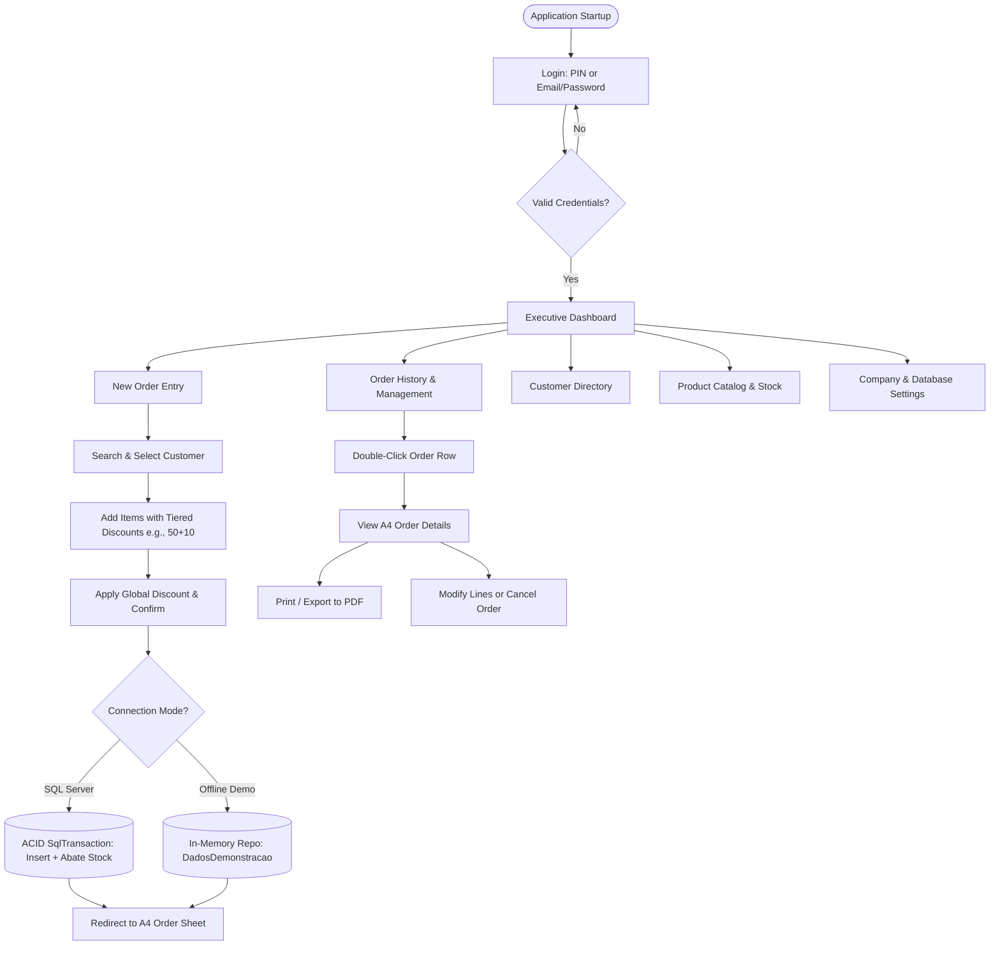

# 💼 Commercial Sales Manager (SFA)

[](https://dotnet.microsoft.com/)
[](https://docs.microsoft.com/dotnet/csharp/)
[](https://learn.microsoft.com/aspnet/core/blazor/hybrid/)
[](https://tailwindcss.com/)
[](https://www.microsoft.com/sql-server/)
[]()
[](https://visualstudio.microsoft.com/)
[](LICENSE)

> Enterprise Desktop **Sales Force Automation (SFA)** and B2B Order Management System engineered to streamline the daily operational workflow of Commercial Directors in technical distribution and electrical equipment industries.

> [!NOTE]
> **User Interface Localization:** While this technical documentation is in English, the application's user interface is localized in **European Portuguese (pt-PT)** to align directly with B2B commercial practices and regulatory terminology in Portugal.

---

## 📖 Overview & Business Context

In traditional B2B commercial distribution, a significant portion of sales transactions and contractual pricing agreements are still drafted manually: paper order pads (*carbon copy forms*), manual calculation of cascading tiered discounts, and delayed transcription into central ERP/billing systems.

**Commercial Sales Manager** digitizes and automates this end-to-end sales lifecycle:
* **Instant Customer Identification:** Predictive lookup by Tax Identification Number (NIF), Company Name, Phone, or City.
* **Technical Catalog & Real-Time Stock:** Live inventory verification with direct stock adjustment capabilities.
* **Tiered Cascading Discount Engine:** Native support for B2B chained discount formulas (e.g., `50+10`, `40+5+2`), widely used by electrical material manufacturers.
* **Corporate A4 Order Forms:** Automated generation of formal order notes ready for physical printing or digital PDF archival.
* **Commission & Performance Tracking:** Executive dashboard delivering consolidated financial KPIs per period and instant CSV/Excel export.
* **Intelligent Hybrid Operation:** Native high-performance connectivity with Microsoft SQL Server and seamless automatic fallback to an offline demonstration mode when off-network.

---

## 🏗️ System Architecture

The application adopts a modern **Hybrid Desktop Architecture (.NET 8 + Blazor WebView)**:

```
┌─────────────────────────────────────────────────────────────┐
│               Windows Forms Shell Host                      │
│               (FormMenu.cs hosting BlazorWebView)           │
├─────────────────────────────────────────────────────────────┤
│         Blazor WebView Components (HTML5 / Tailwind CSS)    │
│  ├── Dashboard.razor       ├── Clientes.razor               │
│  ├── NovaVenda.razor       ├── Produtos.razor               │
│  ├── Encomendas.razor      ├── Definicoes.razor             │
│  └── DetalhesEncomenda.razor                                │
├─────────────────────────────────────────────────────────────┤
│                    C# Business Logic Layer                  │
│  ├── Sessao.cs (User Authentication & Commission Terms)     │
│  ├── ConfiguracaoEmpresa.cs (JSON Company Profile Store)    │
│  └── DatabaseConfig.cs (SQL Discovery & Connectivity)       │
├──────────────────────────────┬──────────────────────────────┤
│    Online Mode (Production)  │   Offline Mode (Demo Mock)   │
│    Microsoft.Data.SqlClient  │   DadosDemonstracao.cs       │
│    Microsoft SQL Server      │   Thread-Safe In-Memory Repo │
│    DB: Software_Vendas_Pai   │   Seed Electrical Catalog    │
└──────────────────────────────┴──────────────────────────────┘
```

### Architectural Highlights:
1. **Lightweight Native WinForms Shell:** Boots instantly without the memory footprint of local web servers or Electron runtimes.
2. **Reactive Blazor UI:** Single-page navigation styled with Tailwind CSS utility classes, providing fluid transitions and responsive layouts.
3. **Decoupled Business Logic:** Seller session state, corporate profiles, and database abstraction layers remain decoupled from the visual layer.

---

## ✨ Key Features

### ⚡ Ergonomic Dual Authentication
* **Dual Login Options:**
  * **Quick 4-digit PIN:** Optimized for touchscreens, field tablets, and high-frequency logins between client site visits.
  * **Email & Password:** Standard corporate login supporting multiple user profiles (*Sales Representative*, *Commercial Director*, *Administrator*).
* **Centralized Session State (`Sessao.cs`):** Retains active seller credentials, role permissions, and contractual commission rates in memory.

### 📦 Material Catalog & Dynamic Stock Management
* **Predictive Product Search:** Real-time keyword filtering across item codes and commercial descriptions.
* **Rapid Stock Adjustments:** Contextual modal allowing immediate stock replenishment or deduction directly from the catalog or sales screens.
* **Item Registration:** Add new items with category/family assignments, base retail prices (PVP), and customizable VAT rates.

### 🧮 Compounding Cascading Discount Engine
In electrical distribution and technical B2B trade, supplier discounts are commonly expressed in cascading tiers rather than single flat rates:
$$\text{Effective Unit Price} = \text{PVP} \times (1 - d_1) \times (1 - d_2) \times \dots \times (1 - d_n)$$

* **Supported Notations:** Composed strings such as `50+10`, `40+5+2.5`, or flat percentages (`35%`).
* **Global Order Discount:** Financial closing discount applied over the total transaction balance.
* **Automatic VAT Computation:** Dynamic tax calculation (standard Portuguese 23% or custom rate) with transparent subtotal, tax amount, and final gross total.

### 🛡️ ACID Transactions & Atomic Inventory Abatement
* In SQL Server mode, all finalized orders execute within an atomic `SqlTransaction`:
  1. Creates the header record in `Encomenda`.
  2. Inserts all associated detail lines into `Linha_Encomenda`.
  3. Deducts ordered quantities immediately from `Material` inventory (`Stock = Stock - @Quantity`).
* If any step encounters an exception, the entire transaction triggers a `Rollback()`, preventing orphan orders or inventory corruption.
* **Stock Restoration on Edit/Cancel:** Editing an existing order restores previous stock quantities before applying the updated line adjustments atomically.

### 📄 Corporate A4 Order Documents (Print & PDF)
* High-fidelity order view rendered according to standard European A4 dimensions:
  * Company header with customizable corporate identity (legal name, NIF, registered address, direct contacts).
  * Customer dossier and assigned commercial representative.
  * Itemized table with material codes, descriptions, quantities, base prices, cascading discounts, and line totals.
  * Tax breakdown summary (Net Subtotal, Discounts, Total VAT, Total Payable).
  * Formal stamp and signature confirmation blocks.
* Direct **Print to Physical Printer** and one-click export to **Microsoft Print to PDF**.

### 📊 Performance Dashboard & Executive Reporting
* **Real-Time Sales Metrics:**
  * Total revenue billed over the active period (€).
  * Cumulative earned sales commissions (€) computed dynamically from the authenticated user's contractual percentage.
  * Active customer portfolio count.
  * Volume of finalized orders.
* **Flexible Temporal Filters:** Today, Current Month, Current Year, Custom Calendar Date Range, or All-Time.
* **Printable Executive Summary:** Clean A4 report summarizing financial performance and average order value (AOV).
* **Excel Export (CSV):** Instant CSV export formatted for analysis in Microsoft Excel or Google Sheets.

### 🏢 Configurable Enterprise Profile (`empresa_config.json`)
* Built-in Settings screen to manage:
  * Legal Company Name, Business Subtitle, NIF, Address, Postal Code, Phone Number, and Email.
* Changes persist to local JSON storage and immediately update headers on all newly generated order sheets and reports without restarting the application.

---

## 🔄 Operational Workflow



---

## 🗄️ Relational Database Model (SQL Server)

The database adheres strictly to Third Normal Form (3NF) with enforced foreign keys:


---

## ⌨️ Ergonomics & Keyboard Shortcuts

Engineered for high-speed order entry without requiring constant mouse reliance:
* <kbd>Enter</kbd> on Code/Description field: automatically adds the item if an exact match is detected.
* <kbd>↑</kbd> / <kbd>↓</kbd> in autocomplete popup: smoothly navigates through suggested product matches.
* <kbd>F2</kbd> (or dedicated button): focuses the product search input immediately.
* **Double-click** on any Order row: opens the official A4 Order Form.
* **Double-click** on any Customer row: instantly initiates a new order for that customer.

---

## 🚀 Setup & Getting Started

### Prerequisites
* [.NET 8.0 SDK](https://dotnet.microsoft.com/download/dotnet/8.0) (v8.0.x or higher)
* [Microsoft SQL Server](https://www.microsoft.com/sql-server/) (Developer, Express, or LocalDB)
* [Visual Studio 2022](https://visualstudio.microsoft.com/) with *.NET Desktop Development* workload (or VS Code with C# Dev Kit)

### 1. Clone the Repository
```bash
git clone https://github.com/Afonsojlc/commercial-sales-manager.git
cd commercial-sales-manager
git checkout feature/new-ui-BlazorWebView
```

### 2. Configure the Database (Optional for Demo Testing)
1. Open [`Estrutura_BD_Software_Vendas.sql`](Estrutura_BD_Software_Vendas.sql) in SQL Server Management Studio (SSMS).
2. Execute the script to create the `Software_Vendas_Pai` database, tables, relationships, and default seed records.
3. If SQL Server is not running or unreachable, the application automatically boots into **Offline Demonstration Mode**, providing full in-memory functionality without errors.

### 3. Build the Solution
```bash
dotnet build SoftwareVendas/SoftwareVendas.sln
```

### 4. Run the Application
```bash
dotnet run --project SoftwareVendas/SoftwareVendas/SoftwareVendas.csproj
```

### 5. Access Credentials

#### 🟢 Production Mode (Connected to Microsoft SQL Server)
* **Commercial Director (Full Administrative Privileges):**
  * Email: `jgcarvalho007@gmail.com` | Password: `Paredes10`
  * Quick PIN: `1755`
  * Seller: **José Carvalho** (Commission: `7.00%`)
* **Sales Representative:**
  * Email: `acsousalopes@gmail.com` | Password: `Paredes11`
  * Quick PIN: `1514`
  * Seller: **Antonia Lopes** (Commission: `2.00%`)

#### 🟡 Offline Demonstration Sandbox Mode (No SQL Server Required)
* Automatically activates whenever SQL Server is unreachable, or via the direct **"Entrar em Modo Demonstração (Sandbox)"** button on the Login screen.
* **Demonstration Director Profile:**
  * Representative: **Afonso Carvalho** (Marked with `DEMO` badge)
  * Email: `afonso.carvalho@geral.pt` | Password: `demo` or `admin`
  * Quick PIN: `1234` (or `0000`)
  * Full administrative privileges to explore the system.
  * In-memory isolated storage (`DadosDemonstracao.cs`): test orders, created customers, or stock adjustments are kept in memory and never alter the production SQL database.

---

## 📁 Repository Structure

```
commercial-sales-manager/
├── Estrutura_BD_Software_Vendas.sql     # SQL Server DDL schema initialization script
├── Dados_Iniciais_Seed.sql              # Initial seed data script (materials, clients, sellers)
├── Visualizar_Tabelas.sql               # Diagnostic queries for SQL Server tables
├── README.md                            # Comprehensive project documentation
└── SoftwareVendas/
    ├── SoftwareVendas.sln               # Visual Studio 2022 Solution
    └── SoftwareVendas/
        ├── FormMenu.cs                  # WinForms host window embedding BlazorWebView
        ├── DatabaseConfig.cs            # Connection manager with instance auto-discovery
        ├── Sessao.cs                    # Global session holder for authenticated seller & roles
        ├── ConfiguracaoEmpresa.cs       # Company settings profile manager (empresa_config.json)
        ├── DadosDemonstracao.cs         # Thread-safe in-memory mock repository for offline demo
        ├── Components/
        │   ├── App.razor                # Root Blazor component hosting Router and layout
        │   ├── Layout/
        │   │   └── MainLayout.razor     # Collapsible sidebar, top search, and status badges
        │   └── Pages/
        │       ├── Login.razor          # Dual authentication screen (PIN & Email/Password)
        │       ├── Dashboard.razor      # KPIs, commission metrics, reports, and CSV exports
        │       ├── NovaVenda.razor      # Order entry screen with cascading discount logic
        │       ├── Encomendas.razor     # Orders register, statuses, and advanced filtering
        │       ├── DetalhesEncomenda.razor # Formal A4 order view for print and PDF
        │       ├── Clientes.razor       # Customer portfolio management (Director-restricted creation)
        │       ├── Produtos.razor       # Technical product catalog & stock controls
        │       └── Definicoes.razor     # Company profile, user profile & sales team management
        └── wwwroot/
            ├── index.html               # Main HTML entrypoint with Tailwind typography
            └── css/                     # Custom corporate stylesheets and print media rules
```

---

## 👨‍💻 Author

**Afonso Carvalho**  
* GitHub: [@Afonsojlc](https://github.com/Afonsojlc)  
* Student in Information Systems Programming Technologies (*TPSI*) — IPMAIA
