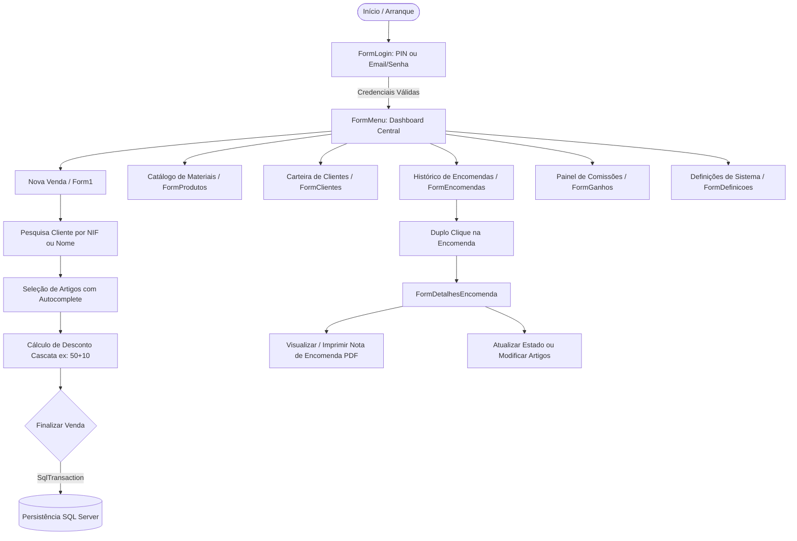
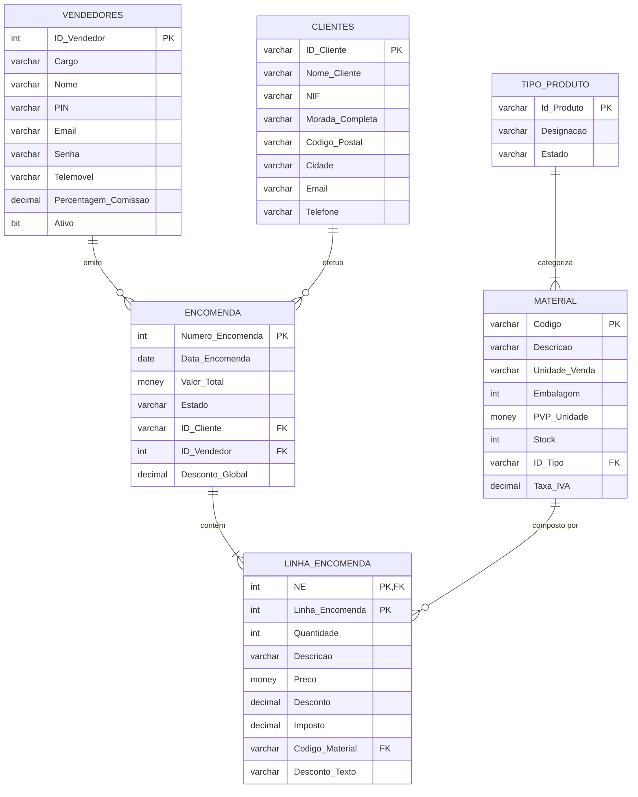

# 💼 Commercial Sales Manager (SFA)

[](https://dotnet.microsoft.com/)
[](https://docs.microsoft.com/dotnet/csharp/)
[](https://learn.microsoft.com/dotnet/desktop/winforms/)
[](https://www.microsoft.com/sql-server/)
[]()
[](https://visualstudio.microsoft.com/)
[](LICENSE)

> Sistema Desktop de **Sales Force Automation (SFA)** e Gestão de Encomendas B2B desenvolvido sob medida para apoiar a atividade diária de uma Direção Comercial no setor de distribuição técnica e material elétrico.

---

## 📖 Contexto e Propósito

Nas operações comerciais tradicionais de distribuição B2B, grande parte dos registos de encomendas e cálculos de condições contratuais ainda é realizada de forma analógica: preenchimento manual em blocos físicos de papel químico (*notas de encomenda*), cálculo manual de descontos comerciais complexos e contabilidade manual de comissões por vendedor.

O **Commercial Sales Manager** foi concebido a partir de um caso de uso 100% real: **digitalizar e automatizar todo o ciclo de trabalho de um Diretor Comercial no terreno**, desde a identificação do cliente e seleção de materiais com regras de desconto em cascata até à emissão atómica da nota de encomenda, impressão de documentos oficiais e monitorização em tempo real do volume de faturação e comissões ganhas.

---

## ✨ Funcionalidades Principais

### ⚡ Autenticação Comercial Ergonómica
* **Modo Dual de Login:**
  * **Acesso Rápido por PIN (4 dígitos):** Otimizado para comerciais em trânsito com teclado numérico.
  * **Acesso por E-mail & Senha:** Autenticação tradicional para postos fixos.
* **Gestão de Sessão (`Sessao.cs`):** Armazena em memória o utilizador autenticado, cargo e percentagem de comissão contratual.

### 📦 Catálogo de Materiais & Stock Dinâmico
* **Modo Vendas vs. Modo Gestão:** O catálogo adapta a sua interface consoante o contexto (seleção rápida para inserção em encomenda vs. manutenção de inventário e preços).
* **Pesquisa Preditiva (AutoComplete):** Sugestões dinâmicas de artigos à medida que o utilizador digita o código ou a descrição.
* **Ajuste Rápido de Stock:** Menu de contexto para consultar e reajustar o inventário de qualquer produto em tempo real.

### 🧮 Motor de Desconto Comercial Composto (Notação B2B em Cascata)
No setor da distribuição e material elétrico, os descontos raramente são planos, adotando expressões encadeadas sobre o Preço de Venda ao Público (PVP) de tabela (ex: `50+10`, `40+5+2` ou percentagens padrão).
* **Algoritmo de Cascata:** O sistema processa recursivamente cada desconto sucessivo:
  $$\text{Preço Final} = \text{PVP} \times (1 - d_1) \times (1 - d_2) \times \dots \times (1 - d_n)$$
* Suporte a desconto global adicional no fecho da transação e cálculo automático de IVA à taxa em vigor.

### 🛡️ Transações ACID Atómicas (`SqlTransaction`)
* Toda a finalização de encomenda (cabeçalho `Encomenda` + múltiplas linhas `Linha_Encomenda`) é executada dentro de uma **transação SQL atómica**. Se ocorrer qualquer falha no processo, a transação reverte integralmente (*rollback*), impedindo estados inconsistentes ou faturas órfãs.
* Na eliminação de encomendas, o sistema reverte automaticamente as quantidades de artigos ao inventário (`Stock`), preservando a integridade física do armazém.

### 📄 Impressão e Emissão de Nota de Encomenda (PDF)
* **Geração Nativa de Documento Oficial:** Módulo integrado via `System.Drawing.Printing.PrintDocument` que gera a folha oficial de Nota de Encomenda com layout corporativo:
  * Cabeçalho da empresa e metadados da encomenda (Número, Data, Estado, Comercial).
  * Ficha cadastral do cliente (Nome, NIF, Contactos, Morada).
  * Tabela discriminada de materiais, quantidades, preços de tabela, descontos aplicados e totais.
  * Resumo financeiro (Subtotal, Desconto Global, Total a Pagar).
  * Campo para assinatura do cliente e carimbo da empresa.
* Compatível com impressoras físicas e com exportação direta para **Microsoft Print to PDF**.

### 💰 Dashboard de Comissões & Ganhos (`FormGanhos.cs`)
* **KPIs em Tempo Real:**
  * Total Faturado Hoje (€)
  * Total Faturado no Mês Vigente (€)
  * Comissão Acumulada no Mês (€) calculada automaticamente sobre as vendas do utilizador.
  * Quantidade total de encomendas processadas.
* Tabela cronológica com o histórico de faturas e comissão auferida linha a linha.

### ⚙️ Centralização da Base de Dados (`DatabaseConfig.cs`)
* Todas as chamadas ADO.NET (`Microsoft.Data.SqlClient`) são canalizadas através de uma arquitetura centralizada.
* Ecrã de definições para testar conectividade e reconfigurar a *connection string* sem necessidade de recompilar a aplicação.

---

## 🔄 Fluxo Operacional



---

## 🗄️ Modelo Relacional da Base de Dados

O modelo de dados segue a 3.ª Forma Normal (3NF) com integridade referencial estrita:



---

## 🚀 Como Executar Localmente

### Pré-requisitos
* [.NET 8.0 SDK](https://dotnet.microsoft.com/download/dotnet/8.0)
* [Visual Studio 2022](https://visualstudio.microsoft.com/) (com o workload *.NET Desktop Development*)
* [Microsoft SQL Server](https://www.microsoft.com/sql-server/) (Developer, Express ou LocalDB)
* SQL Server Management Studio (SSMS) ou Azure Data Studio

### 1. Clonar o Repositório
```bash
git clone https://github.com/Afonsojlc/commercial-sales-manager.git
cd commercial-sales-manager
git checkout development
```

### 2. Configurar a Base de Dados
1. Abra o ficheiro [`Estrutura_BD_Software_Vendas.sql`](Estrutura_BD_Software_Vendas.sql) no SSMS.
2. Execute o script para criar a base de dados `Software_Vendas_Pai` e todas as tabelas com os devidos relacionamentos e valores predefinidos.

### 3. Configurar a String de Conexão
Caso a sua instância do SQL Server não seja `Server=localhost\SQLEXPRESS`:
* Abra [`SoftwareVendas/SoftwareVendas/DatabaseConfig.cs`](SoftwareVendas/SoftwareVendas/DatabaseConfig.cs) e ajuste a propriedade `ConnectionString`, ou utilize o ecrã de **Definições** na própria aplicação.

### 4. Compilar e Iniciar
Pelo Visual Studio 2022 ou via CLI:
```bash
dotnet build SoftwareVendas/SoftwareVendas.sln
dotnet run --project SoftwareVendas/SoftwareVendas/SoftwareVendas.csproj
```

---

## 👨‍💻 Autor

**Afonso Carvalho**  
* GitHub: [@Afonsojlc](https://github.com/Afonsojlc)  
* Estudante de Tecnologias de Programação de Sistemas de Informação (TPSI) — IPMAIA
